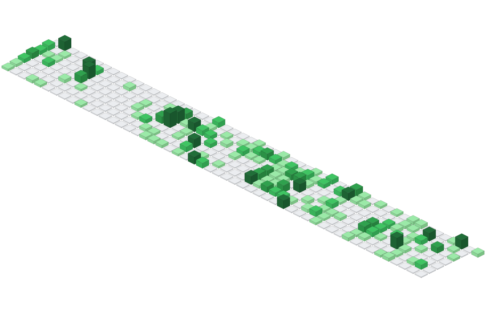
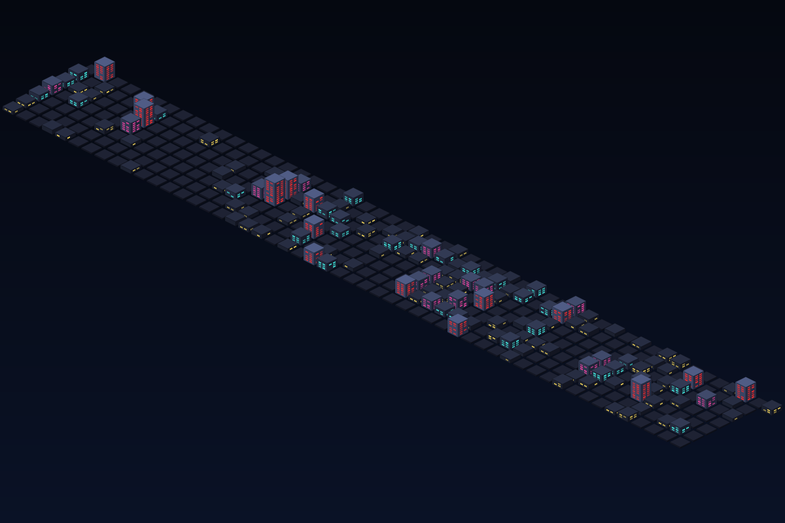

<div align="center">
  <!-- 如果有 Logo，可以在此处替换 -->
  <!--  -->

  <h1>🏙️ GitHub City Skyline</h1>

  <p>
    将你的 GitHub 贡献图转化为令人惊叹的 3D 等距城市天际线！<br/>
    (Transform your GitHub contribution graph into a stunning 3D isometric city skyline!)
  </p>

  <p>
    <a href="https://github.com/Haruko386-UnOffical/github-city/blob/main/LICENSE">
      
    </a>
    
    
  </p>
</div>

## 📖 简介

**GitHub City Skyline** 旨在为你原本平面的 2D GitHub 贡献图注入立体生命力。通过抓取你的 commit 历史记录，本项目可以自动生成一张体积感十足的 3D 建筑物 SVG 插图，并支持多种动态光影主题，是你装点 GitHub 个人主页 (Profile README) 的绝佳工具。

## ✨ 核心特性

- **🧊 3D 等距投影 (3D Isometric Projection)**：算法将单调的 2D 贡献方块转化为错落有致的立体 3D 建筑。
- **🎨 丰富的动态主题 (Dynamic Themes)**：
  - `github`：经典的绿色方块风格，干净、明亮。
  - `cityNight`：黑暗赛博朋克美学，带有随机点亮、仿佛在呼吸的霓虹灯窗户。
- **🤖 零干预全自动化 (Fully Automated)**：专为 GitHub Actions 设计。配置一次后，即可在每天后台静默运行，每日自动更新你的天际线。

## 🏗️ 效果展示

> 💡 预览本项目生成的不同主题效果

**默认主题 (Default - `github`)**


**城市之夜 (cityNight)**


---

## 🚀 快速开始

### 方案 A：通过 GitHub Actions 自动生成（🌟 强烈推荐，无需本地环境）

如果你只想在个人主页展示，**无需 Fork 本仓库**，只需在你自己的仓库（如个人同名主页仓库）中添加一个工作流即可。

1. 在你的仓库中，创建文件 `.github/workflows/generate-city.yml`。
2. 填入以下配置代码：

```yaml
name: Generate 3D City
on:
  schedule:
    # 每天 00:00 UTC 自动运行
    - cron: "0 0 * * *"
  workflow_dispatch:

jobs:
  build:
    runs-on: ubuntu-latest
    permissions:
      contents: write
      
    steps:
      - name: Checkout
        uses: actions/checkout@v3

      - name: Generate City Skyline
        uses: Haruko386-UnOffical/github-city@main
        with:
          github_token: ${{ secrets.GITHUB_TOKEN }}
          theme: github # 可修改为 cityNight

      - name: Commit and Push
        run: |
          git config user.name "github-actions[bot]"
          git config user.email "github-actions[bot]@users.noreply.github.com"
          git add -f city.svg
          git commit -m "chore: update 3D city skyline" || exit 0
          git push
```

3. **配置权限**：进入你仓库的 `Settings -> Actions -> General`，向下滚动到 `Workflow permissions`，勾选 **Read and write permissions** 并保存。

4. **首次运行**：前往 `Actions` 标签页，手动触发一次 `Generate 3D City` 工作流。

### 方案 B：本地开发与运行

如果你想参与项目开发、修改渲染逻辑或创建专属主题，可以在本地运行：

**1. 环境准备**

- Node.js (推荐 v18 或更高版本)
- 一个具有 `read:user` 权限的 GitHub Personal Access Token (PAT)

**2. 克隆与安装**

```Bash
git clone [https://github.com/Haruko386-UnOffical/github-city.git](https://github.com/Haruko386-UnOffical/github-city.git)
cd github-city
npm install
```

**3. 配置环境变量** 将根目录下的 `.env.example` 复制并重命名为 `.env`，填入信息：

```
GITHUB_TOKEN=your_personal_access_token_here
GITHUB_USERNAME=your_github_username
```

**4. 运行生成器**

```Bash
# 使用默认经典主题生成
node index.js

# 或者通过环境变量指定主题 (Mac/Linux)
THEME=cityNight node index.js

# Windows PowerShell:
$env:THEME="cityNight"; node index.js
```

## 💻 使用示例

无论是通过 Actions 还是本地生成，根目录下都会产出一个 `city.svg` 文件。在你的 `README.md` 中直接引用它即可：

```Markdown

```

## 🎨 主题开发指南

本项目的主题具有极高的可扩展性。主题文件位于 `src/themes/` 目录下。你可以导出一个 JS 对象来创建新主题：

```JavaScript
export default {
    name: "myCustomTheme",
    defs: "", // 可选：SVG 标签定义（例如渐变色、滤镜）
    backgroundFill: "#ffffff", // 背景颜色
    
    // 根据每日 contribution 数量决定各个面的颜色
    top: (contribution) => { /* 返回顶部颜色 */ },
    left: (contribution) => { /* 返回左侧颜色 */ },
    right: (contribution) => { /* 返回右侧颜色 */ },
    
    // 可选：启用 3D 映射的窗户效果
    windowColor: (contribution) => { /* 返回窗户颜色逻辑 */ }
}
```

## 🗺️ 路线图 (Roadmap)

- [x] 核心 3D 转换与渲染逻辑
- [x] GitHub Actions 自动化工作流支持
- [x] 多主题系统架构 (`github`, `cityNight`)
- [ ] 优化超长历史记录的渲染性能
- [ ] 增加更多节假日限定主题（如：万圣节、圣诞节）

## 🤝 参与贡献

我们非常欢迎任何形式的贡献，无论是新主题、Bug 修复还是新功能！

1. Fork 本仓库
2. 创建您的特性分支 (`git checkout -b feature/AmazingTheme`)
3. 提交您的修改 (`git commit -m 'feat: add AmazingTheme'`)
4. 推送至分支 (`git push origin feature/AmazingTheme`)
5. 开启一个 Pull Request (PR)

## 📄 协议 (License)

本项目基于 [MIT License](https://www.google.com/search?q=LICENSE) 协议开源。Feel free to use and modify!

## ✉️ 联系方式

- **项目维护者**: [Haruko386-UnOffical](https://www.google.com/search?q=https://github.com/Haruko386-UnOffical)
- 欢迎在 Issues 区提出宝贵建议或报告 Bug。